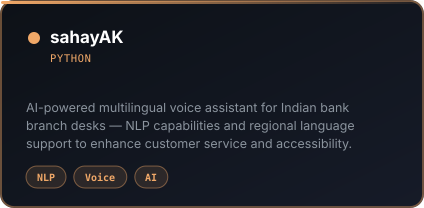

<!-- ══════════════════════════════  HERO  ══════════════════════════════ -->

<!-- Self-Hosted Animated Avatar Scanner Banner -->

 
 

 
 

### ⚡ Quick Navigation

<kbd>[🧠 About](#about)</kbd> &nbsp;
<kbd>[🛠️ Stack](#stack)</kbd> &nbsp;
<kbd>[🚀 Projects](#projects)</kbd> &nbsp;
<kbd>[📊 Stats](#stats)</kbd> &nbsp;
<kbd>[🐍 Snake](#snake)</kbd> &nbsp;
<kbd>[🤝 Connect](#connect)</kbd>

---

<!-- ══════════════════════════════  ABOUT  ══════════════════════════════ -->

  

  

 

  

 

<b>👉 Expanded Profile Details & Achievements (click to expand)</b>

 

### 🎯 Core Engineering Focus

- **AI & Machine Learning**: Building ML models for financial markets, anomaly detection, and predictive analytics.
- **FinTech Systems**: Creating practical financial tools for mutual fund analysis, payroll management, and market intelligence.
- **Full Stack Development**: End-to-end applications built with React, Next.js, Node.js, Flask, PostgreSQL, and Supabase.
- **Agentic AI & NLP**: Implementing LLM-powered agents and multilingual voice workflows for specialized domains.

### 🏆 Key Highlights & Leadership

- **Founder & FinTech Head** — Finance & Technology Club at KJSSE, driving FinTech innovation and technical research.
- **Organized FinovateX 2026** — 7-hour dual-event featuring AlgoTrading and Fraud Detection challenges.
- **Founders Office Intern** at Rayze Technologies & **Industrial Services & Cyber Security Intern** at TÜV Rheinland India.
- **Academic Excellence** — Maintaining a 9.04 SGPA while building production-grade applications.

---

<!-- ══════════════════════════════  STACK  ══════════════════════════════ -->

  

### 💻 Core Technologies

**Languages**  

 

**Frontend Frameworks & UI**  

 

**Backend & APIs**  

 

**AI / ML · Data Science**  

 

**Databases & Cloud**  

 

**Developer Tools & Environment**  

 

<b>🤖 Specialization Badges & Libraries</b>

 

#### Machine Learning & Data Science

#### LLMs & Agentic AI

#### FinTech & Financial Engineering

---

<!-- ══════════════════════════════  PROJECTS  ══════════════════════════════ -->

  

<!-- 2x2 Grid of Custom Project Cards -->
<table border="0" width="100%">
  <tr>
    <td width="50%" align="center" style="border:none;">
      
    </td>
    <td width="50%" align="center" style="border:none;">
      
    </td>
  </tr>
  <tr>
    <td width="50%" align="center" style="border:none;">
      
    </td>
    <td width="50%" align="center" style="border:none;">
      
    </td>
  </tr>
</table>

 

  

 

  

---

<!-- ══════════════════════════════  STATS  ══════════════════════════════ -->

  

<table border="0" width="100%">
  <tr>
    <td width="50%" align="center" style="border:none;">
      
    </td>
    <td width="50%" align="center" style="border:none;">
      
    </td>
  </tr>
</table>

 

---

<!-- ══════════════════════════════  SNAKE  ══════════════════════════════ -->

  

  

---

<!-- ══════════════════════════════  CONNECT  ══════════════════════════════ -->

  

&nbsp;

&nbsp;

  

**Interested in AI/ML, FinTech innovation, or building high-impact systems?**  
*Open to internships, engineering research collaborations, and production software projects.*

