<!-- ══════════════════════════════  HERO  ══════════════════════════════ -->

<!-- Self-Hosted Holographic Quantum Identity Banner -->

### ⚡ Quick Navigation

<kbd>[🧠 About](#about)</kbd> &nbsp;
<kbd>[🛠️ Stack](#stack)</kbd> &nbsp;
<kbd>[🚀 Projects](#projects)</kbd> &nbsp;
<kbd>[📊 Stats](#stats)</kbd> &nbsp;
<kbd>[🐍 Snake](#snake)</kbd> &nbsp;
<kbd>[🤝 Connect](#connect)</kbd>

  

---

<!-- ══════════════════════════════  ABOUT  ══════════════════════════════ -->

  

  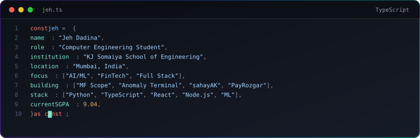

 

  <a href="https://jehdadina.xyz">
    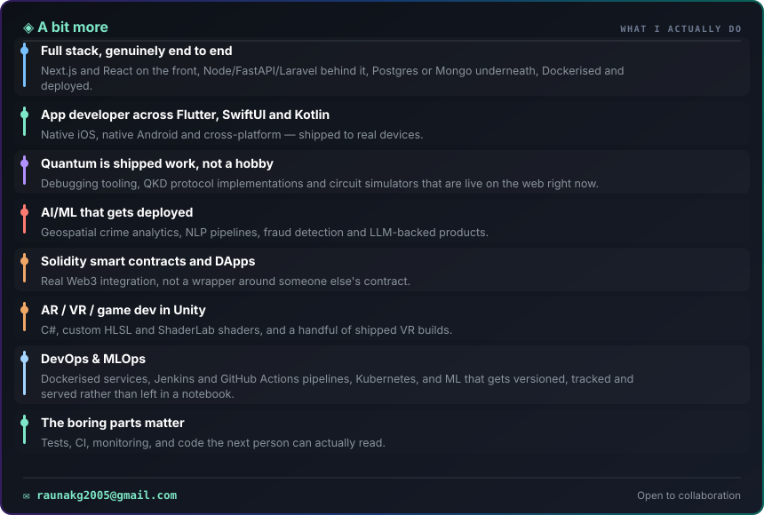
  </a>

---

<!-- ══════════════════════════════  STACK  ══════════════════════════════ -->

  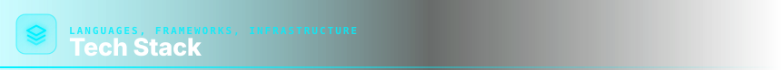

**Languages**  
<table><tr><td align="center" width="90"> Python</td><td align="center" width="90"> TypeScript</td><td align="center" width="90"> JavaScript</td><td align="center" width="90"> C++</td><td align="center" width="90"> C</td><td align="center" width="90"> Java</td></tr></table>

**Frontend Frameworks & UI**  
<table><tr><td align="center" width="90"> React</td><td align="center" width="90"> Next.js</td><td align="center" width="90"> Vite</td><td align="center" width="90"> HTML5</td><td align="center" width="90"> CSS5</td><td align="center" width="90"> Tailwind</td><td align="center" width="90"> Electron</td><td align="center" width="90"> Figma</td></tr></table>

**Backend & APIs**  
<table><tr><td align="center" width="90"> Node.js</td><td align="center" width="90"> Express</td><td align="center" width="90"> Flask</td><td align="center" width="90"> FastAPI</td><td align="center" width="90"> Python</td></tr></table>

**AI / ML · Data Science**  
<table><tr><td align="center" width="90"> PyTorch</td><td align="center" width="90"> TensorFlow</td><td align="center" width="90"> scikit-learn</td><td align="center" width="90"> Anaconda</td><td align="center" width="90"> D3.js</td></tr></table>

**Databases & Cloud**  
<table><tr><td align="center" width="90"> PostgreSQL</td><td align="center" width="90"> Supabase</td><td align="center" width="90"> MongoDB</td><td align="center" width="90"> MySQL</td><td align="center" width="90"> Vercel</td><td align="center" width="90"> Netlify</td></tr></table>

**Developer Tools & Environment**  
<table><tr><td align="center" width="90"> Git</td><td align="center" width="90"> GitHub</td><td align="center" width="90"> VS Code</td><td align="center" width="90"> Linux</td><td align="center" width="90"> Docker</td><td align="center" width="90"> Windows</td><td align="center" width="90"> Postman</td></tr></table>

---

<!-- ══════════════════════════════  PROJECTS  ══════════════════════════════ -->

  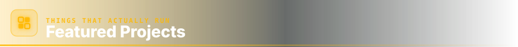

<!-- 2x3 Grid of 6 Distinct Colored Custom Project Cards -->
<table border="0" width="100%">
  <tr>
    <td width="50%" align="center" style="border:none;">
      <a href="https://github.com/jehdadina-jpg/anomaly">
        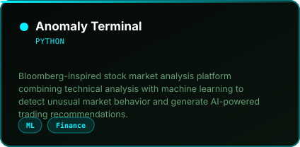
      </a>
    </td>
    <td width="50%" align="center" style="border:none;">
      <a href="https://github.com/FTC-KJSSE/payrozgar">
        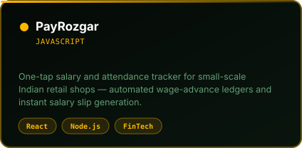
      </a>
    </td>
  </tr>
  <tr>
    <td width="50%" align="center" style="border:none;">
      <a href="https://github.com/jehdadina-jpg/MFScope">
        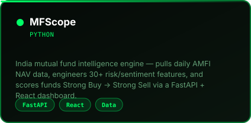
      </a>
    </td>
    <td width="50%" align="center" style="border:none;">
      <a href="https://github.com/jehdadina-jpg/swiperight">
        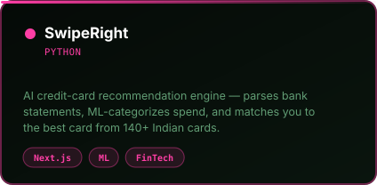
      </a>
    </td>
  </tr>
  <tr>
    <td width="50%" align="center" style="border:none;">
      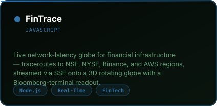
    </td>
    <td width="50%" align="center" style="border:none;">
      <a href="https://github.com/jehdadina-jpg/GitControl">
        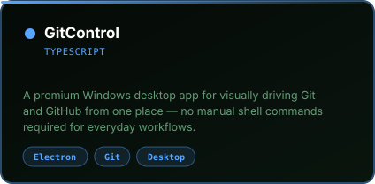
      </a>
    </td>
  </tr>
  <tr>
    <td width="50%" align="center" style="border:none;">
      <a href="https://moneyflow-nu.vercel.app/">
        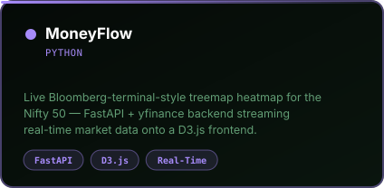
      </a>
    </td>
    <td width="50%" style="border:none;"></td>
  </tr>
</table>

 

  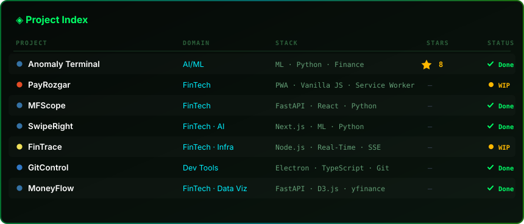

 

  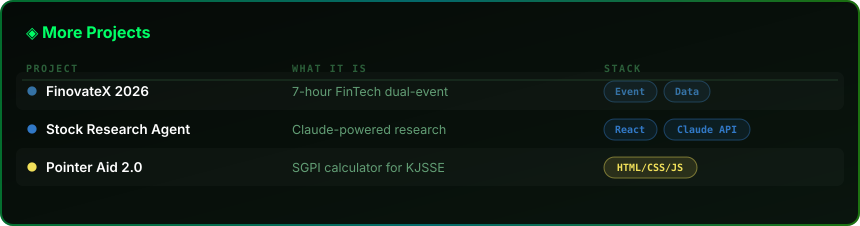

---

<!-- ══════════════════════════════  STATS  ══════════════════════════════ -->

  

<table border="0" width="100%">
  <tr>
    <td width="50%" align="center" style="border:none;">
      
    </td>
    <td width="50%" align="center" style="border:none;">
      
    </td>
  </tr>
</table>

---

<!-- ══════════════════════════════  SNAKE  ══════════════════════════════ -->

  

  

---

<!-- ══════════════════════════════  CONNECT  ══════════════════════════════ -->

  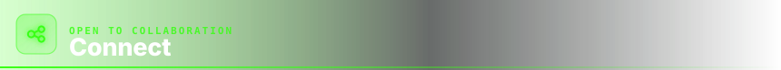

&nbsp;

&nbsp;

  

**Interested in AI/ML, FinTech innovation, or building high-impact systems?**  
*Open to internships, engineering research collaborations, and production software projects.*

 
